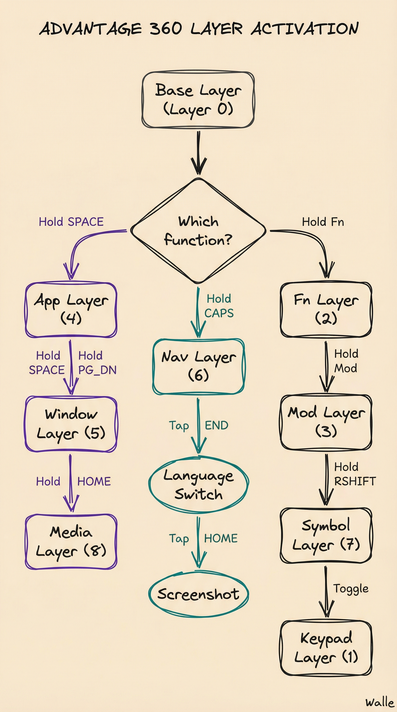

# Advantage 360 Pro - Custom Configuration User Guide

**Custom ZMK firmware configuration optimized for macOS development workflow**

Last updated: December 18, 2025

---

## Table of Contents

1. [Introduction](#introduction)
2. [Quick Reference](#quick-reference)
3. [Layer Activation Guide](#layer-activation-guide)
4. [Layer Reference](#layer-reference)
   - [Layer 0: Base Layer](#layer-0-base-layer)
   - [Layer 1: Keypad](#layer-1-keypad)
   - [Layer 2: Function Keys](#layer-2-function-keys)
   - [Layer 3: Mod (System)](#layer-3-mod-system)
   - [Layer 4: App Launcher](#layer-4-app-launcher)
   - [Layer 5: Window Management](#layer-5-window-management)
   - [Layer 6: Navigation](#layer-6-navigation)
   - [Layer 7: Symbol](#layer-7-symbol)
   - [Layer 8: Media](#layer-8-media)
   - [Layer 9: Edit](#layer-9-edit)
5. [Combo System](#combo-system)
6. [Zellij Terminal Navigation](#zellij-terminal-navigation)
7. [Tips & Workflows](#tips--workflows)
8. [Appendix](#appendix)

---

## Introduction

This custom configuration transforms the Advantage 360 Pro into a productivity powerhouse optimized for macOS development workflows. The design philosophy:

- **Layer-based access** - Multiple layers activated via hold-tap behaviors
- **Home row optimization** - Keep fingers on home position
- **Vim-inspired navigation** - HJKL movement patterns throughout
- **macOS integration** - Native shortcuts for window management, screenshots, media
- **Terminal-first** - Zellij integration for seamless terminal navigation

**Key Features:**
- 10 layers (0-9) covering all workflows
- Edit layer with Flycut clipboard history integration
- Window management with fractional sizing
- Media controls without leaving home position
- Zellij terminal navigation via Alt shortcuts
- Smart capitalization with caps_word and caps lock

---

## Quick Reference

### Most Common Operations

| Function | Action | Notes |
|----------|--------|-------|
| **Screenshot** | Tap HOME | Area selection (⇧⌘4) |
| **Language Switch** | Tap END | Switches input language |
| **Caps Word** | Tap CAPS | One word capitalize |
| **Caps Lock** | Double-tap CAPS | Sticky caps (all keys) |
| **Copy** | Hold ` + C | Edit layer |
| **Paste** | Hold ` + V | Edit layer |
| **Flycut History** | Hold ` + B | Clipboard cycling |
| **Undo** | Hold ` + Z | Edit layer |
| **Window Left Half** | Hold PG_DN, tap H | Cycles: half → 1/4 → 3/4 |
| **Window Right Half** | Hold PG_DN, tap L | Cycles: half → 1/4 → 3/4 |
| **Window Left 1/4** | lHold PG_DN, tap U | Direct 1/4 sizing |
| **Window Right 1/4** | Hold PG_DN, tap O | Direct 1/4 sizing |
| **Volume Up/Down** | Hold HOME, tap U/J | Media layer |
| **Brightness Up/Down** | Hold HOME, tap I/K | Media layer |
| **Zellij Panel Nav** | Alt+H/J/K/L | Vim-style navigation |
| **Zellij Tab Switch** | Alt+A/F | Previous/Next tab |

### Layer Activation Keys

| Key | Tap Behavior | Double-Tap | Hold Behavior |
|-----|--------------|------------|---------------|
| **HOME** | Screenshot (⇧⌘4) | - | → Media Layer (8) |
| **END** | Language Switch (⌃Space) | - | - |
| **GRAVE** (`) | Backtick | - | → Edit Layer (9) |
| **SPACE** | Space | - | → App Layer (4) |
| **PG_DN** | Page Down | - | → Window Layer (5) |
| **CAPS** | Caps Word | Caps Lock | → Nav Layer (6) |
| **RSHIFT** | Right Shift | - | → Symbol Layer (7) |
| **Fn** (top left) | - | - | → Fn Layer (2) |
| **Mod** (top right) | - | - | → Mod Layer (3) |

---

## Layer Activation Guide



### Activation Methods

**Layer-Tap (tap-preferred, 200ms tapping term):**
- Quick tap < 200ms = Tap behavior
- Hold > 200ms = Activates layer
- Used for: HOME, SPACE, PG_DN, CAPS, RSHIFT

**Momentary (mo):**
- Hold to activate, release to deactivate
- Used for: Fn, Mod

**Toggle:**

- Press once to activate, press again to deactivate
- Used for: Keypad (Layer 1)

---

## Layer Reference

### Layer 0: Base Layer

**Default typing layer with homerow mods**

**Display Name:** Base

**Special Features:**
- Standard QWERTY layout
- Homerow mods on ASDF/JKL; (hold for modifiers)
- Layer access keys in thumb cluster
- END key = Language switch (⌃Space)

**Thumb Cluster Layout:**

```
Left:  Fn  |  `  | CAPS↓Nav | ←  | →  | Bksp | Opt
Right: 🌐Lang | PG_DN↓Win | Enter | SPACE↓App | ↑ | ↓ | [ | ] | Fn
       (END)    (Window)            (Apps)
```

**Key Features:**

- ESC on home row (instead of Caps Lock)
- Layer-tap keys for quick access to all layers
- Arrow keys in thumb cluster -=_+_for quick navigationq

---

### Layer 1: Keypad

**Numpad functionality for number-heavy work**

**Display Name:** Kp

**Activation:** Toggle with top-left key (next to =)

**Layout:**
```
Right Hand Numbers:
7 8 9 -    (top row)
4 5 6 +    (home row)
1 2 3 Ent  (bottom row)
    0 .    (thumb)
```

**Use Cases:**
- Spreadsheet work
- Calculator-style number entry
- Accounting/finance workflows

**Tip:** Toggle on when doing lots of number entry, toggle off when done

---

### Layer 2: Function Keys

**F1-F12 for system shortcuts and app-specific commands**

**Display Name:** Fn

**Activation:** Hold Fn key (top left corner, MO 2)

**Layout:**
```
F1  F2  F3  F4  F5  F6          F7  F8  F9  F10 F11 F12
```

**Common Uses:**
- F1-F2: Brightness (macOS default)
- F3: Mission Control
- F4: Spotlight
- F7-F9: Media controls (macOS default)
- F10-F12: Volume (macOS default)

**Note:** Function keys follow standard macOS behavior

---

### Layer 3: Mod (System)

**System controls: Bluetooth, bootloader, lighting**

**Display Name:** Mod

**Activation:** Hold Mod key (top right corner, MO 3)

**Features:**
- **Bluetooth:** BT_SEL 0-4 (select device), BT_CLR (clear)
- **Bootloader:** Enter bootloader mode for flashing
- **Lighting:** Backlight toggle/increase/decrease
- **RGB:** RGB toggle (if applicable)
- **Version:** Display firmware version

**Layout:**
```
Top Row:  BT0 BT1 BT2 BT3 BT4
Special:  Bootloader (top row middle positions)
          BT_CLR (center)
          Lighting controls (bottom right)
```

**Warning:** Use bootloader mode carefully - only for firmware updates

---

### Layer 4: App Launcher

**Hyper key app launchers (⌘⌥⌃⇧+letter)**

**Display Name:** App

**Activation:** Hold SPACE (LT_SPC 4 SPACE)

**App Shortcuts:**

| Key | App | Shortcut |
|-----|-----|----------|
| **T** | Terminal | Hyper+T |
| **C** | Cursor | Hyper+C |
| **P** | Perplexity | Hyper+P |
| **B** | Browser | Hyper+B |
| **S** | Slack | Hyper+S |
| **N** | Notion | Hyper+N |
| **M** | Meets | Hyper+M |
| **F** | Finder | Hyper+F |
| **D** | Calendar | Hyper+D |
| **A** | Arc | Hyper+A |
| **I** | IntelliJ | Hyper+I |
| **K** | Kill Process | Hyper+K |
| **W** | Postman | Hyper+W |
| **O** | Obsidian | Hyper+O |
| **H** | Clipboard History | Hyper+H |
| **U** | Translate (Ukrainian) | Hyper+U |
| **G** | Google Search | Hyper+G |
| **L** | Linear | Hyper+L |
| **;** | My Linear Issues | Hyper+; |

**Setup Required:**
Configure these Hyper key shortcuts in macOS:
1. Install app launcher tool (Raycast, Alfred, or Keyboard Maestro)
2. Map Hyper+Letter to launch corresponding apps
3. Hyper = ⌘⌥⌃⇧ (all modifiers together)

**Tip:** This gives instant app switching without Cmd+Tab hunting

---

### Layer 5: Window Management

**Precise window positioning and sizing**

**Display Name:** Win

**Activation:** Hold PG_DN (LT_PGDN 5 PG_DN)

**Window Control Layout:**

```
Top Row:     [U: ¼ Left]         [O: ¼ Right]

Home Row:    [H: Left]  [J: Center]  [K: Max]  [L: Right]
             (cycles)   (cycles)                (cycles)
```

**Shortcuts:**

| Key | Function | Shortcut | Cycle Behavior |
|-----|----------|----------|----------------|
| **U** | Left 1/4 | ⌘⌃U | Direct sizing |
| **O** | Right 1/4 | ⌘⌃O | Direct sizing |
| **H** | Left Sizes | ⌘⌃H | Cycle: half → 1/4 → 3/4 |
| **J** | Center Sizes | ⌘⌃J | Cycle: half → 1/3 |
| **K** | Maximize | ⌘⌃K | Full screen |
| **L** | Right Sizes | ⌘⌃L | Cycle: half → 1/4 → 3/4 |

**Raycast Configuration Required:**
Set up window management shortcuts in Raycast:
- ⌘⌃H: Left half → Left 1/4 → Left 3/4 (cycle)
- ⌘⌃J: Center half → Center 1/3 (cycle)
- ⌘⌃K: Maximize
- ⌘⌃L: Right half → Right 1/4 → Right 3/4 (cycle)
- ⌘⌃U: Left 1/4 (direct)
- ⌘⌃O: Right 1/4 (direct)

**Workflow Example:**
1. Hold PG_DN with right thumb
2. Press H once for left half
3. Press H again for left 1/4
4. Press H again for left 3/4
5. Or press U directly for left 1/4

---

### Layer 6: Navigation

**Vim-style cursor navigation and text manipulation**

**Display Name:** Nav

**Activation:** Hold CAPS (LT_CAPS 6 0)

**CAPS Key Multi-Function:**
- **Single Tap** = Caps Word (capitalize one word, auto-off)
- **Double Tap** (within 200ms) = Caps Lock (sticky caps, stays on)
- **Hold** (> 200ms) = Nav Layer (vim navigation)

**Caps Word Usage:**
Tap CAPS, then type a word - it will be capitalized and automatically return to lowercase after the word ends. Perfect for typing constants like API_KEY.

**Caps Lock Usage:**
Double-tap CAPS quickly (within 200ms) to enable sticky caps lock. All subsequent letters will be capitalized until you tap CAPS again to turn it off.

**Navigation Layout:**

```
Home Row:  [A: Line Start]              [H: ←]  [J: ↓]  [K: ↑]  [L: →]
Top Row:   [W: Word →]    [B: Word ←]                        [PG_UP]
Bottom:                                             [PG_DN]
```

**Shortcuts:**

| Key | Function | Behavior |
|-----|----------|----------|
| **H** | Left | ← arrow |
| **J** | Down | ↓ arrow |
| **K** | Up | ↑ arrow |
| **L** | Right | → arrow |
| **W** | Word Right | ⌥→ |
| **E** (or B) | Word Left | ⌥← |
| **A** | Line Start | ⌘← |
| **E** | Line End | ⌘→ |
| **PG_UP** | Page Up | Scroll up |
| **PG_DN** | Page Down | Scroll down |

**Caps Word Feature:**
- Tap CAPS = Smart caps (auto-off after word)
- Great for typing constants: TAP → type API_KEY → auto-lowercase after

**Use Case:** Navigate code and text without moving hands from home row

---

### Layer 7: Symbol

**Programming symbols on home row**

**Display Name:** Sym

**Activation:** Hold RSHIFT (LT_RSHFT 7 RSHFT)

**Symbol Layout:**

```
Number Row:  `  !  @  #  $  %          ^  &  *  _  +  ~
Top Row:     [  ]  <  >                (  )  {  }  |
Home Row:    -  =  _  +  \             (transparent)  :  "
```

**Quick Access Symbols:**
- Brackets: [ ] < > ( ) { }
- Operators: + - = _ * & | \
- Special: ! @ # $ % ^ ~ `

**Use Case:** Programming without reaching for number row or shifting

---

### Layer 8: Media

**Media controls, brightness, volume, screenshots**

**Display Name:** Media

**Activation:** Hold HOME (LT_HOME 8 0), Tap HOME = Screenshot Area

**Media Layout:**

```
Left Hand (Screenshots):
  [W: Window]
  [A: Area]  [S: Full]

Right Hand (Controls):
  Top Row:     [U: Vol+]    [I: Bright+]
  Home Row:    [H: ←Track]  [J: Vol-]  [K: Bright-]  [L: Track→]  [;: Play/Pause]
  Bottom Row:  [N: Mute]
```

**Controls:**

| Function | Keys | Shortcut |
|----------|------|----------|
| **Volume Up** | U | Consumer Control |
| **Volume Down** | J | Consumer Control |
| **Mute** | N | Consumer Control |
| **Brightness Up** | I | Consumer Control |
| **Brightness Down** | K | Consumer Control |
| **Previous Track** | H | Consumer Control |
| **Next Track** | L | Consumer Control |
| **Play/Pause** | ; | Consumer Control |
| **Screenshot Area** | HOME tap | ⇧⌘4 |
| **Screenshot Full** | A (in layer) | ⇧⌘3 |
| **Screenshot Window** | W (in layer) | ⇧⌘4 Space |

**Workflow:**
1. **Quick screenshot:** Tap HOME (most common)
2. **Media control:** Hold HOME + U/J for volume
3. **Full screen shot:** Hold HOME + S

---

### Layer 9: Edit

**Complete editing suite with Flycut clipboard history**

**Display Name:** Edit

**Activation:** Hold GRAVE (`) (LT_GRAVE 9 GRAVE), Tap GRAVE = `

**Edit Layout:**

```
Left Hand Editing:
  Top Row:     [R: Redo]
  Home Row:    [A: Select All]  [S: Save]
  Bottom Row:  [Z: Undo]  [X: Cut]  [C: Copy]  [V: Paste]  [B: Flycut]
```

**Complete Editing Operations:**

| Key | Function | Shortcut | Notes |
|-----|----------|----------|-------|
| **Z** | Undo | ⌘Z | Standard undo |
| **X** | Cut | ⌘X | Cut to clipboard |
| **C** | Copy | ⌘C | Copy to clipboard |
| **V** | Paste | ⌘V | Paste from clipboard |
| **B** | Flycut History | ⇧⌘V | Cycle clipboard history |
| **S** | Save | ⌘S | Save current file |
| **A** | Select All | ⌘A | Select all content |
| **R** | Redo | ⇧⌘Z | Redo last undo |

**Flycut Integration:**
- **V key** = Normal paste (most recent clipboard)
- **B key** = Browse clipboard history (Flycut cycling)
- B is right next to V for natural progression: paste → browse history

**Workflow Example:**
1. Select text (normal selection or use Nav layer)
2. Hold GRAVE + C = Copy
3. Navigate to destination
4. Hold GRAVE + V = Paste
5. Need older clipboard? Hold GRAVE + B = Cycle Flycut history

**Why This Layer:**
- Reliable (no timing issues like combos)
- One-handed left hand operation
- Familiar Z/X/C/V positions (muscle memory from Cmd shortcuts)
- Complete editing suite in one place
- Flycut integration for power clipboard workflows

**Tip:** This replaces the unreliable combo system - use Edit layer instead!

---

## Combo System

**⚠️ Note:** The combo system is still configured but may be unreliable (50ms timing). **Recommend using Edit layer (GRAVE hold) instead.**

**Home row combos for editing operations**

**Timing:** 50ms window (press keys simultaneously)

### Editing Combos (Right Hand)

| Combo | Function | Shortcut |
|-------|----------|----------|
| **J+K** | Copy | ⌘C |
| **K+L** | Paste | ⌘V |
| **J+L** | Cut | ⌘X |

### Editing Combos (Left Hand)

| Combo | Function | Shortcut |
|-------|----------|----------|
| **S+D** | Undo | ⌘Z |
| **D+F** | Redo | ⇧⌘Z |
| **F+G** | Save | ⌘S |

### Tab Management Combos (Top Row)

| Combo | Function | Shortcut |
|-------|----------|----------|
| **W+E** | New Tab | ⌘T |
| **E+R** | Close Tab | ⌘W |
| **Q+W** | Reopen Tab | ⇧⌘T |

**Key Positions:**
```
Left Hand:   S  D  F  G
Right Hand:  J  K  L
Top Row:     Q  W  E  R
```

**Tip:** Combos are faster than reaching for ⌘ key combinations

---

## Zellij Terminal Navigation

**Instant Alt-based navigation without mode switching**

### Configuration Location
`~/.config/zellij/config.kdl`

### Panel Navigation (Alt+HJKL)

| Shortcut | Function | Zellij Command |
|----------|----------|----------------|
| **Alt+H** | Focus Left Panel | MoveFocus "left" |
| **Alt+J** | Focus Down Panel | MoveFocus "down" |
| **Alt+K** | Focus Up Panel | MoveFocus "up" |
| **Alt+L** | Focus Right Panel | MoveFocus "right" |

### Tab Navigation

| Shortcut | Function | Zellij Command |
|----------|----------|----------------|
| **Alt+A** | Previous Tab | GoToPreviousTab |
| **Alt+F** | Next Tab | GoToNextTab |
| **Alt+1-9** | Jump to Tab | GoToTab [1-9] |

### Tab Management

| Shortcut | Function | Zellij Command |
|----------|----------|----------------|
| **Shift+Alt+H** | Move Tab Left | MoveTab "left" |
| **Shift+Alt+L** | Move Tab Right | MoveTab "right" |
| **Ctrl+Shift+T** | New Tab | NewTab |
| **Ctrl+Shift+N** | New Pane | NewPane |

### Preserved Shortcuts

**Still Available:**
- **Ctrl+Arrows:** MoveFocusOrTab (Ctrl navigation)
- **Ctrl+1-9:** GoToTab (alternative to Alt+1-9)
- **Mode Switching:** P (pane), T (tab), R (resize), S (scroll)

**Default Mode:** Locked (stay in this mode most of the time)

**Workflow:**
1. Use Alt+HJKL for fast panel navigation (very frequent)
2. Use Alt+A/F for tab switching (frequent)
3. Use Alt+1-9 for direct tab jumps (occasional)
4. Use mode switching (P/T/R) only for advanced operations

---

## Tips & Workflows

### Window Management Workflow

**Scenario:** Arranging windows for development

1. **Browser left half:** Hold PG_DN, press H
2. **Terminal right half:** Hold PG_DN, press L
3. **Editor right 3/4:** Focus editor, hold PG_DN, press L twice
4. **Small reference left 1/4:** Hold PG_DN, press U

### Screenshot Workflow

**Scenario:** Capturing UI for documentation

1. **Quick area capture:** Tap HOME (most common)
2. **Full screen:** Hold HOME, press S
3. **Specific window:** Hold HOME, press W (then click window)
4. **Area from media layer:** Hold HOME, press A

### Terminal Navigation Workflow

**Scenario:** Working in Zellij with multiple panes

1. **Split terminal:** Ctrl+Shift+N (new pane)
2. **Navigate between panes:** Alt+H/J/K/L (vim-style)
3. **Create new tab:** Ctrl+Shift+T
4. **Switch tabs:** Alt+A/F or Alt+[number]
5. **Move tab position:** Shift+Alt+H/L

### Editing Workflow

**Scenario:** Refactoring code

1. **Select text:** Shift+arrows or Hold CAPS + HJKL
2. **Copy:** J+K combo
3. **Navigate:** Hold CAPS + HJKL to move cursor
4. **Paste:** K+L combo
5. **Undo if needed:** S+D combo

---

## Appendix

### Key Position Reference

**Advantage 360 Pro has 76 keys total:**

```
Left Hand:                Right Hand:
0  1  2  3  4  5  6       7  8  9  10 11 12 13
14 15 16 17 18 19 20      21 22 23 24 25 26 27
28 29 30 31 32 33 34      39 40 41 42 43 44 45
46 47 48 49 50 51         54 55 56 57 58 59
60 61 62 63 64            71 72 73 74 75

Thumbs Left: 35 36, 52, 65 66 67
Thumbs Right: 37 38, 53, 68 69 70
Center: (varies by layout)
```

**Home Row Positions:**
- Left: A(28) S(29) D(30) F(31) G(32)
- Right: H(39) J(40) K(41) L(42) ;(43)

### Combo Key Positions

**For 50ms timing window:**
- J(40) + K(41) = Copy
- K(41) + L(42) = Paste
- J(40) + L(42) = Cut
- S(29) + D(30) = Undo
- D(30) + F(31) = Redo
- F(31) + G(32) = Save

### Troubleshooting

**Layer not activating:**
- Hold key for full 200ms (tap-preferred timing)
- Check if layer is correctly defined in keymap
- Verify behavior is correctly referenced

**Combo not triggering:**
- Press keys within 50ms window (very quick)
- Ensure both keys pressed simultaneously
- Check key position numbers match combo definition

**Shortcuts not working:**
- **Window management:** Verify Raycast configuration
- **App launchers:** Check Hyper key mapping in launcher app
- **Zellij:** Restart Zellij session to load new config

**Firmware Issues:**
- Reflash firmware: `make` then flash
- Check for syntax errors in keymap
- Verify all referenced macros are defined

### Building & Flashing

**Build firmware:**
```bash
make
```

**Flash to keyboard:**
1. Enter bootloader mode (Mod layer + Bootloader key)
2. Keyboard appears as USB drive
3. Copy firmware file to drive
4. Keyboard automatically reflashes and restarts

### Configuration Files

**Main Files:**
- `config/adv360.keymap` - Layer definitions, behaviors
- `config/macros.dtsi` - Macro definitions (shortcuts)
- `~/.config/zellij/config.kdl` - Zellij keybindings

**Reference:**
- `assets/key-positions.md` - Physical key positions
- `config/info.json` - Layout metadata

---

## Complete Feature Summary

### Layers (10 Total)
✅ Layer 0: Base (QWERTY + homerow mods)
✅ Layer 1: Keypad (numpad)
✅ Layer 2: Function keys (F1-F12)
✅ Layer 3: Mod (system controls)
✅ Layer 4: App launcher (Hyper shortcuts)
✅ Layer 5: Window management (halves, thirds, quarters)
✅ Layer 6: Navigation (vim HJKL)
✅ Layer 7: Symbol (programming symbols)
✅ Layer 8: Media (volume, brightness, media, screenshots)
✅ Layer 9: Edit (complete editing suite with Flycut)

### Special Features
✅ Edit layer with Flycut clipboard history (GRAVE hold)
✅ CAPS triple function (single=caps word, double=caps lock, hold=nav)
✅ Layer-tap behaviors (tap vs hold)
✅ Single-key language switch (END key)
✅ Single-key screenshot (HOME tap)
✅ Zellij Alt navigation (no mode switching)
✅ 9 home row combos (legacy, Edit layer recommended)

### Integration Points
✅ Raycast window management
✅ Zellij terminal multiplexer
✅ macOS system shortcuts
✅ Hyper key app launching

---

**Happy typing! This configuration is optimized for keeping your hands on home row and maximizing productivity.**

*For questions or issues, refer to the ZMK documentation: https://zmk.dev*
